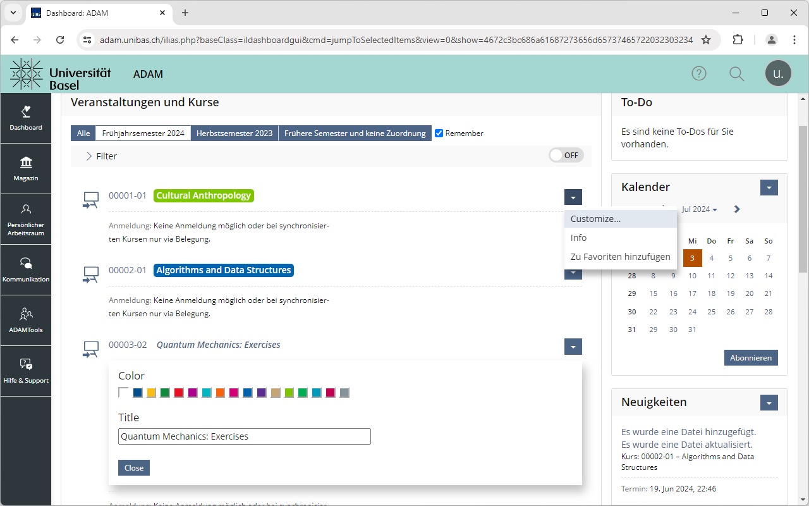

# ADAMatic

ADAMatic automates the sequence of interactions required to log in to ADAM, the learning management system of the University of Basel. Additionally, it adds some small tweaks to the website, such as customizable course labels and an option to remember the previously selected course list.

Once ADAMatic is installed, enter your SWITCH edu-ID credentials in the extension's popup window to enable the automatic login. **Note that your credentials are stored unencrypted**, and that, at least with Chrome, they are synchronized between your devices by your browser.

ADAMatic never interacts with your credentials outside of the intended functionality, and they are removed when you remove the extension.

## Installation

ADAMatic is available [in the Chrome Web Store](https://chromewebstore.google.com/detail/falhcaokchhdmcihdbjkgmmmgkdiijpd).

Packages are available under [releases](https://github.com/thechnet/adamatic/releases).
