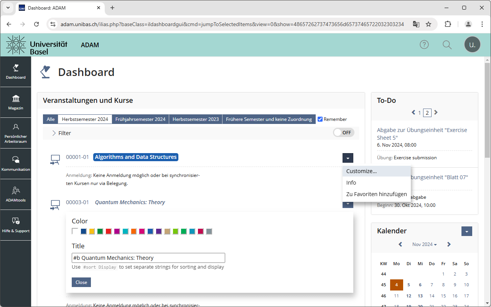

# ADAMatic

<!--@begin abstract-->
ADAMatic automates the interactions required to log in to ADAM, the learning management system of the University of Basel, and adds some small quality-of-life features to the website.
<!--@end-->

<!--@begin table-->
Feature|Screenshot
---|---
Enter your Switch edu-ID credentials in the extension's popup window to enable the automatic login.     <i class="disclaimer">Be aware that ADAMatic doesn't encrypt your edu-ID credentials, and that depending on how your browser is configured, they may be synchronized between your devices through unencrypted channels.</i>|
Enable the **Remember** option to preserve the course list selection across sessions.|
Use **Customize…** in the dropdown menu of any course to personalize its label.|
<!--@end-->

## Installation

ADAMatic is available [in the Chrome Web Store](https://chromewebstore.google.com/detail/falhcaokchhdmcihdbjkgmmmgkdiijpd).

Packages are available under [releases](https://github.com/thechnet/adamatic/releases).
